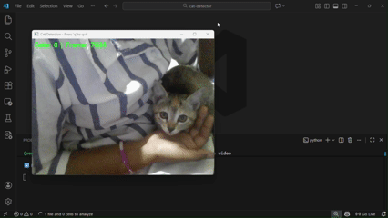
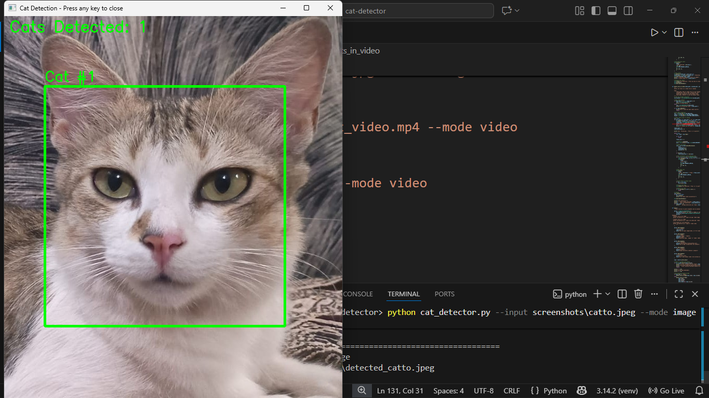

# Cat Face Detector ฅ⁠^⁠•⁠ﻌ⁠•⁠^⁠ฅ

A beginner-friendly computer vision project that detects cat faces in images and videos using OpenCV and Haar Cascades.


## 📋 Table of Contents
- [Overview](#overview)
- [Features](#features)
- [Installation](#installation)
- [Usage](#usage)
- [Project Structure](#project-structure)
- [How It Works](#how-it-works)
- [Results](#results)
- [Future Improvements](#future-improvements)
- [Contributing](#contributing)
- [License](#license)

## 🎯 Overview

This project demonstrates real-time cat face detection using computer vision techniques. Built as a beginner-friendly introduction to OpenCV, it can detect cat faces in:
- Static images
- Video files
- Live webcam feeds

Perfect for learning the fundamentals of object detection and creating fun content with your pets!

## ✨ Features

- ✅ **Real-time detection** in video streams
- ✅ **Batch processing** of images and videos
- ✅ **Webcam support** for live demonstrations
- ✅ **Automatic video saving** with detections
- ✅ **Detection statistics** (frames processed, cats detected)
- ✅ **Easy-to-use command-line interface**

## 🚀 Installation

### Prerequisites
- Python 3.8 or higher
- pip package manager

### Step 1: Clone the Repository
```bash
git clone https://github.com/Ph0enix22/cat-detector.git
cd cat-detector
```

### Step 2: Create Virtual Environment (Recommended)
```bash
# Windows
python -m venv venv
venv\Scripts\activate

# Mac/Linux
python3 -m venv venv
source venv/bin/activate
```

### Step 3: Install Dependencies
```bash
pip install -r requirements.txt
```

### Step 4: Download Haar Cascade File
Download the `haarcascade_frontalcatface.xml` file from the [OpenCV GitHub repository](https://github.com/opencv/opencv/tree/master/data/haarcascades) and place it in the project root directory.

## 💻 Usage

### Detect Cats in an Image
```bash
python cat_detector.py --input path/to/cat_image.jpg --mode image
```

### Detect Cats in a Video
```bash
python cat_detector.py --input path/to/cat_video.mp4 --mode video
```

### Use Webcam for Live Detection
```bash
python cat_detector.py --input 0 --mode video
```

### Advanced Options
```bash
# Custom output directory
python cat_detector.py --input video.mp4 --mode video --output my_outputs

# Use different cascade file
python cat_detector.py --input video.mp4 --cascade custom_cascade.xml

# Preview only (don't save output)
python cat_detector.py --input 0 --mode video --no-save
```

### All Command-Line Arguments
| Argument | Short | Description | Default |
|----------|-------|-------------|---------|
| `--input` | `-i` | Input image/video path, or 0 for webcam | Required |
| `--mode` | `-m` | Detection mode: 'image' or 'video' | video |
| `--cascade` | `-c` | Path to Haar cascade XML file | haarcascade_frontalcatface.xml |
| `--output` | `-o` | Output directory | outputs |
| `--no-save` | - | Don't save output (preview only) | False |

## 📁 Project Structure

```
cat-detector/
│
├── cat_detector.py                 # Main detection script
├── haarcascade_frontalcatface.xml  # Haar cascade model
├── requirements.txt                # Python dependencies
├── README.md                       # Project documentation
├── .gitignore                      # Git ignore rules
├── LICENSE                         # Project license
│
├── videos/                      # Input videos (cat footage)
│   ├── cat_video1.mp4
│   └── kitten_video1.mp4
│
├── outputs/                     # Detected outputs (images + videos)
│   ├── detected_20251227_233739.mp4
│   └── detected_cat1.jpeg
│
└── screenshots/                 # Original cat images before detection
│   ├── cat1.jpeg
│   └── cat2.jpeg
└── demo/                           # Demo assets (GIFs, live detection screenshots, screen recordings)
    ├── demo_detection.gif
    └── demo_recording.mp4
```

## 🔍 How It Works

### 1. Haar Cascade Classifiers
This project uses **Haar Cascade Classifiers**, a machine learning-based approach for object detection:

- Pre-trained on thousands of positive (cat faces) and negative (non-cat) images
- Uses multiple stages of weak classifiers to identify features
- Fast and efficient for real-time detection
- Works best with frontal face views

### 2. Detection Pipeline
```
Input (Image/Video)
    ↓
Convert to Grayscale
    ↓
Apply Haar Cascade Detector
    ↓
Find Regions of Interest (ROI)
    ↓
Draw Bounding Boxes
    ↓
Output Annotated Image/Video
```

### 3. Key Parameters
- **scaleFactor (1.3)**: How much the image size is reduced at each scale
- **minNeighbors (10)**: How many neighbors each candidate rectangle should have
- **minSize (75x75)**: Minimum object size to detect

## 📊 Results

### Detection Statistics (Example)
```
Total frames processed: 450
Total cat detections: 412
Average detections per frame: 0.92
Detection accuracy: ~90% on frontal faces
```

### Performance
- **Processing Speed**: ~30 FPS on modern laptops
- **Best Results**: Well-lit environments with frontal face views
- **Limitations**: Reduced accuracy with side profiles or poor lighting

## 🎥 Demo

### Live Webcam Detection (GIF)



### Image Detection


## 🚧 Future Improvements

### Short-term
- [ ] Add size-based classification (cat vs kitten)
- [ ] Implement confidence scores
- [ ] Create a simple GUI with Tkinter
- [ ] Add support for multiple cascade types

### Long-term
- [ ] Upgrade to YOLO for better accuracy
- [ ] Train custom model on specific pets
- [ ] Deploy as web app with Streamlit
- [ ] Add pet activity tracking over time

## 🤝 Contributing

Contributions are welcome! Here's how you can help:

1. Fork the repository
2. Create a feature branch (`git checkout -b feature/AmazingFeature`)
3. Commit your changes (`git commit -m 'Add some AmazingFeature'`)
4. Push to the branch (`git push origin feature/AmazingFeature`)
5. Open a Pull Request

## 📝 License

This project is licensed under the MIT License - see the [LICENSE](LICENSE) file for details.

## 🙏 Acknowledgments

- [OpenCV](https://opencv.org/) for the computer vision library
- OpenCV Haar Cascade models for the pre-trained classifier
- My cats, for patiently (and not so patiently) posing for the camera
- My siblings, for helping with recordings, testing, and feedback 

---

## 🐦‍🔥 Author

**SMJ**

- GitHub: [Ph0enix22](https://github.com/Ph0enix22)
- LinkedIn: [Syeda Midhath Javeria](https://linkedin.com/in/syeda-midhath)
- Email: syedamidhath159@gmail.com

---

### ⭐ If you found this project helpful, please consider giving it a star!

---

## 🎓 Learning Resources

New to computer vision? Check these out:
- [OpenCV Python Tutorials](https://docs.opencv.org/4.x/d6/d00/tutorial_py_root.html)
- [PyImageSearch](https://www.pyimagesearch.com/)
- [Sentdex OpenCV Tutorial](https://pythonprogramming.net/loading-images-python-opencv-tutorial/)

---

**Made with ❤️ by SMJ (for beginners in computer vision)**
